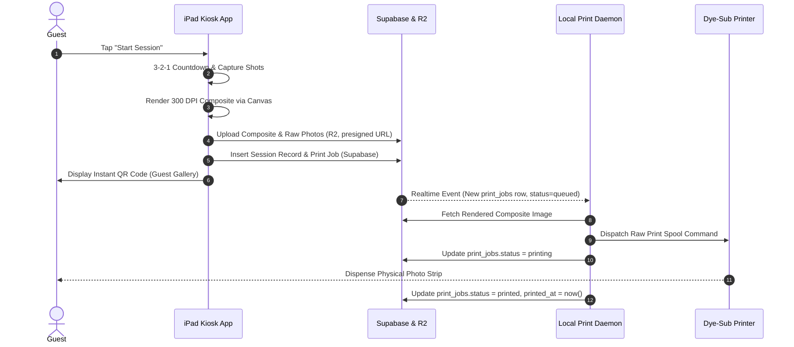

# Operational Workflows — Photo Booth Ecosystem
_Revision 2 — offline routing bug fixed_

## 1. End-to-End Guest Session Lifecycle

Note: the `printing` status update is the checkpoint for the **Print Spool Latency** metric (PRD §3); `printed` is the checkpoint for **Physical Print Latency**.

---

## 2. Offline Fallback Workflow

**v1 bug:** the kiosk previously targeted `http://localhost:8080` when offline. The kiosk (iPad) and the print daemon (venue laptop) are two separate devices on the same LAN — `localhost` on the iPad only ever points back to the iPad itself, so this would silently fail every time. Fixed below.

1. **Network Disconnection Detected:** Kiosk detects `navigator.onLine === false` or a Supabase Realtime heartbeat timeout (>5s no ack).
2. **Local Route Activation:** Kiosk switches its upload/print target to the daemon's **mDNS hostname**: `http://photobooth-print-server.local:8080`. This hostname is broadcast by the daemon itself (see `daemon.mdns.advertise()` in the print daemon), so no manual IP configuration is needed at setup, and it survives DHCP re-leases.
   * Fallback-of-the-fallback: if mDNS resolution fails (some iPad/router combos block it), the kiosk falls back to a manually configured static IP stored in local app settings, entered once during venue setup.
3. **Local Spooling:** Print daemon receives the raw image directly over LAN, triggers the physical print immediately, and logs the job in local SQLite with `status = queued (local)`.
4. **Resync on Reconnection:** Once online status is restored (detected by the daemon, not the kiosk — the daemon is the source of truth for what actually printed), the daemon:
   * Pushes queued local session/print records to Supabase.
   * Uploads any cached images to Cloudflare R2 that hadn't made it up yet.
   * Reconciles `print_jobs.status` so the cloud record matches what actually happened physically (critical: never let the cloud record show `queued` for a job that already printed).

---

## 3. Print Failure & Retry Workflow
_New — v1 defined the retry rule in AGENTS.md but never wired it into a workflow._

1. Daemon attempts print. On spooler error, increment `print_jobs.retry_count`.
2. If `retry_count <= 2`: retry immediately on the same printer.
3. If `retry_count > 2`:
   * Set `print_jobs.status = failed`, populate `error_message`.
   * If a `printers` row with `is_backup = true` exists for the event and `status = online`: re-queue a new `print_jobs` row targeting that printer.
   * Notify the admin dashboard in real time (Supabase Realtime on `print_jobs` — dashboard already subscribes for the live queue view).
